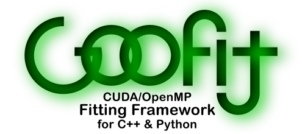

[][GooFit]

[The code][GooFit] • [What's new](https://github.com/GooFit/GooFit/blob/master/CHANGELOG.md) • [Tutorials] • [API documentation]


## The package

[GooFit] is a powerful, fast fitting library designed to mimic the familiar syntax of [ROOT](https://root.cern.ch)'s [RooFit](http://roofit.sourceforge.net). The code and installation instructions are [available here, on GitHub][GooFit], and a description of the fitting process and API is available on [GitHub IO](https://GooFit.github.io/GooFit).


## Docker builds

The development version of GooFit is available through Docker as well. To use the OpenMP version:

```bash
docker run -it goofit/goofit-omp
```

And, the CUDA version:

```bash
nvidia-docker run -it goofit/goofit-cuda
```

This will put you in a `/GooFit` folder. You should git pull the latest changes, and then go to `/GooFit/build` and rebuild. If you have a GooFit Package, you can check it out to `/GooFit/goofit_*`. If you want to persist you session, you should use Docker to mount a volume or folder.

The source for the docker builds is [available on GitHub](https://github.com/GooFit/goofit-docker).

## Publications about GooFit

* [GooFit: A library for massively parallelising maximum-likelihood fits](http://inspirehep.net/record/1302129)
* [Statistical significance estimation of a signal within the GooFit framework on GPUs](http://inspirehep.net/record/1519638)

## Analyses using GooFit

If you are using GooFit, please let us know and we'll try to include your work here.

* [Amplitude analysis of four-body decays using a massively-parallel fitting framework](http://inspirehep.net/record/1514733)
* [Model-independent partial wave analysis using a massively-parallel fitting framework](http://inspirehep.net/record/1516800)
* [Studies of `D⁰ → KS⁰ h⁺ h′⁻` decays at the LHCb experiment](http://inspirehep.net/record/1503518)
* [Measurement of the neutral D meson mixing parameters in a time-dependent amplitude analysis of the `D⁰ → π⁺ π⁻ π⁰` decay](http://inspirehep.net/record/1441203)
* [Measurement of the mixing parameters of neutral charm mesons and search for indirect CP violation with `D⁰ → KS⁰ π⁺ π⁻` decays at LHCb](http://inspirehep.net/record/1503629)
* [Studies of the resonance structure in `D⁰ → KS⁰ K± π∓` decays](http://inspirehep.net/record/1394391)
* [Time-dependent amplitude analysis of semileptonically-tagged `D⁰ → KS⁰ pi⁺ pi⁻` decays at LHCb](http://inspirehep.net/record/1264020)

## See Also

The following tools are similar to GooFit, or mention GooFit in some way.

| Library   | Description |
|-----------|-------------|
| [Hydra](https://github.com/MultithreadCorner/Hydra) | Header only library designed for data analysis focused on performance and precision. This library replaces MCBooster, and is expected to be available in an upcoming release of GooFit, as well. |
| [Ipanema-β](http://inspirehep.net/record/1602619) | Tools and examples for HEP analysis on GPU. |
| [TensorFlowAnalysis](https://gitlab.cern.ch/poluekt/TensorFlowAnalysis) | A TensorFlow based set of examples and code. |

 
## Acknowledgement 

GooFit's development is supported by the National Science Foundation under grant number [1414736]
and was developed under grant number [1005530]. 
Any opinions, findings, and conclusions or recommendations expressed in this material are those of the developers
and do not necessarily reflect the views of the National Science Foundation.
In addition, we thank the nVidia GPU Grant Program for donating hardware used in developing this framework.

[GooFit]:            https://github.com/GooFit/GooFit
[1005530]:           https://nsf.gov/awardsearch/showAward?AWD_ID=1005530
[1414736]:           https://nsf.gov/awardsearch/showAward?AWD_ID=1414736
[Tutorials]:         https://goofit.gitlab.io/Goo2Torial
[API documentation]: https://GooFit.github.io/GooFit
